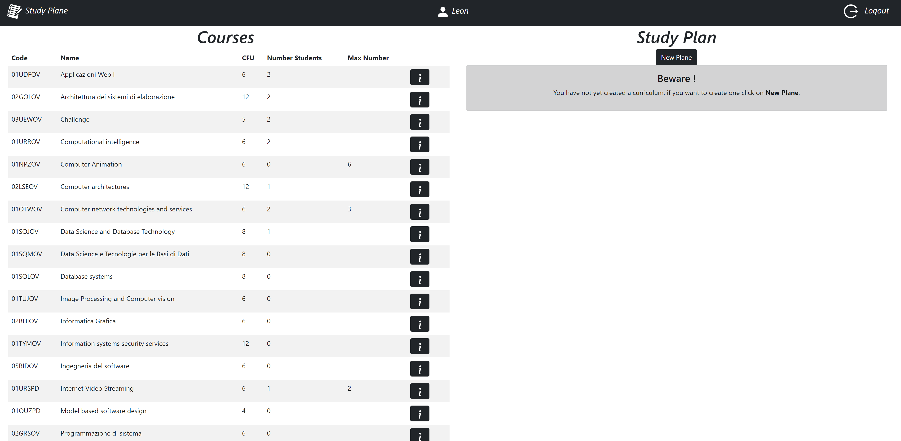
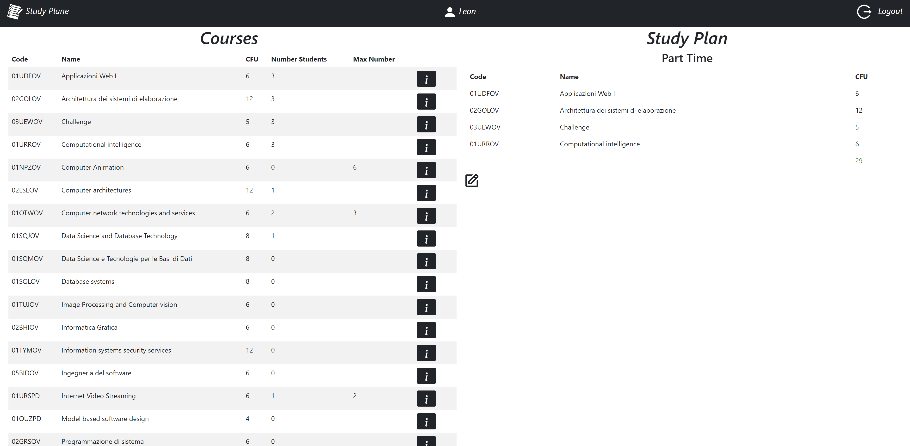
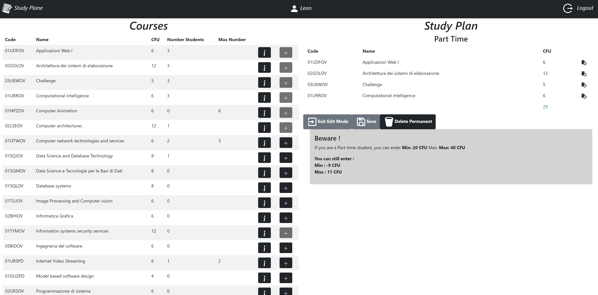
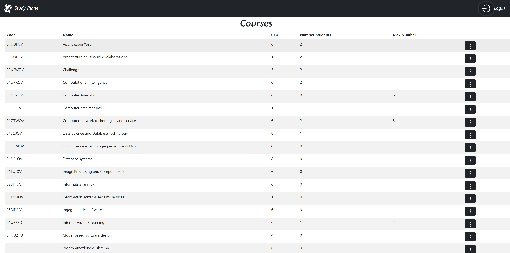

# Exam: "Applicazioni Web 1"

## Student: s291658 DE STEFANO SIMONE

## React Client Application Routes

- Route `/`: There are two cases, when I am not logged in and when I am. In the first case only the table of all courses offered by the university is shown. In the second case, once logged in, both the syllabus and the table of all available courses will be displayed at the same time.

- Route `/login`: This route redirects me to the login page where I can enter my credentials for access, otherwise if I am already logged in it redirects me to the home page

## API Server

### LogIn

URL : `/api/login`

Method: POST

Description: By including email and password, you can be authenticated.

Request body:

```
{
    username: "Leon.Cino",
    password: "Lino"
}
```

Response: `200 Ok` (success), `401 Unauthorized` ("Incorrect username and/or password."), `500 Internal Server Error` (generic error).

Response body:

```
{
    "id":2,
    "username":"Leon.Cino",
    "name":"Leon"
    "fullTime" : 0
}
```

### LogOut

URL: `/api/logout`

Method: DELETE

Description: Removes the session ID by bringing the user into the unauthorised state.

Request body: _None_

Response: `200 Ok` (success), `500 Internal Server Error` (generic error).

Response body: _None_

### Get User Info

URL: `/api/login/current`

Method: GET

Description: By checking the session ID in the browser's cookies you can find out whether the user is authenticated or not.

Request body: _None_

Response: `200 Ok` (success), `401 Unauthorized` ("Unauthenticated user!"), `500 Internal Server Error` (generic error).

Response body:

```
{
    "id":2,
    "username":"Leon.Cino",
    "name":"Leon"
}
```

### Get Courses

URL: `/api/courses`

Method: GET

Description: Retrieval of all Courses fields

Request body: _None_

Response: `200 Ok` (success), `500 Internal Server Error` (generic error).

Response body: All fields of the Courses

```
{
    "Code":02GOLOV,
    "Name":"Architettura dei sistemi di elaborazione",
    "CFU": 12
    "Max Student": null
    "NumStudents" : 2
    "Propaedeuticity": null
}
```

### Get Incompatibility

URL: `/api/incompatibility`

Method: GET

Description: Retrieval of all Incompatibility fields

Request body: _None_

Response: `200 Ok` (success), `500 Internal Server Error` (generic error).

Response body: All fields of the Incompatibility

```
{
    "CurseCode":02GOLOV,
    "Incompatibility":02LSEOV,
}
```

### Get Study Plan

URL: `/api/coursesStudents`

Method: GET

Description: Returning a user's study plan

Request body: _None_

Response: `200 Ok` (success),`401 Unauthorized` ("Unauthenticated user!"), `500 Internal Server Error` (generic error).

Response body: All fields of the study plan

```
{
    "CurseCode":02GOLOV,
    "IDStudent": 2 ,
}
```

### Delete study plan

URL: `/api/deleteStudyPlan`

Method: DELETE

Description:Deleting a student's study plan

Request body: _None_

Response: `204 Ok` (success), `503 error during the deletion of course`

Response body: _None_

### Insert study plane

URL: `/api/insertStudyPlan`

Method: POST

Description: Allows the insertion of a plan for the user

Request body: A description of a study plan

```
{
    "codeCourses":"02GOLOV",
    "FullTime":0,

}

```

Response: `201 Created` (created), `422 Unprocessable Entity` (something missing) or `503 Service Unavailable` (server error).

Response body: _None_

## Database Tables

- Table `Courses` - contains `Code , Name , CFU , MaxStudents,Propaedeuticity`

- Table `Incompatibility` - contains `CourseCode , CodeIncompatibility`

- Table `Students` - contains `ID , Name , Surname , UserName , Password , FullTime , Salt`

- Table `StudentsForCourse` - contains `CourseCode , IDStudent`

## Main React Components

- `NavBar` (in `NavBar.js`): In the Navbar there is a button that allows me to logIn and logOut
- `Courses` (in `CoursesTable.js`): The purpose of the component is to create a table containing all courses, the main functionalities of the table are the display of information about each course, and the addition of a course in the syllabus
- `StudyPlane` (in `StudyPlane.js`):The main purpose of this component is to display the syllabus, the main functionalities are deletion of a course from the syllabus, saving, deletion of the entire syllabus, exiting the edit mode or creating a new syllabus.
  Furthermore, if a study plan already exists, it is displayed, otherwise it gives me the option of creating a new one.

## Screenshot

#### Creating a new Study Plan



#### Visualisation of a study plan



#### Visualisation edit mode



#### Displaying only courses if you are not logged in



## Users Credentials

| UserName        | Password    | Name    |
| --------------- | ----------- | ------- |
| Felice.buonanno | test        | Felice  |
| Leon.Cino       | test        | Leon    |
| Gustavo.Lapasta | test        | Gustavo |
| Pino.Abete      | test        | Pino    |
| Guido.Piano     | test        | Admin   |
| Eros.Peloso     | test        | Eros    |
